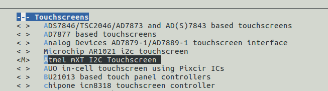
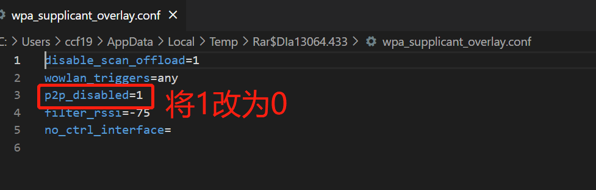
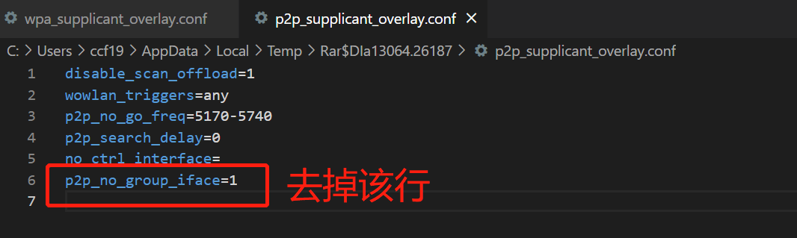

| 版本 | 编辑日期      | 作者   | 备注                    |
| ---- | ------------- | ------ | ----------------------- |
| V1.0 | 2023年2月22日 | 陈超锋 | 初版释放                |
| v1.1 | 2023年3月2日  | 陈超锋 | 添加Android串口筛选内容 |
| v1.2 | 2023年6月19日  | 陈超锋 | 添加和添加修改默认launcher的方法 |

## <span id="system">一、系统编译</span>

### 前期虚拟机环境搭建
如果不使用原先的linux虚拟机，要自己搭建的话，可以先安装如下命令
```shell
sudo apt-get install build-essential subversion git-core repo libncurses5-dev zlib1g-dev \
    gawk flex quilt libssl-dev xsltproc libxml-parser-perl \
    mercurial bzr ecj cvs unzip lib32z1 lib32z1-dev lib32stdc++6 libstdc++6 \
    libncurses-dev zlib1g-dev gawk openssl libssl-dev linux-tools-common gperf -y
```
如果上述环境没有安装的话，可能会出现如下错误：
```shell
INFO: build arisc
make: Entering directory '/home/ceoifung/workspace/a133/longan/brandy/arisc'
arisc defconfig: generate ar100s/.config by sun50iw10p1_axp803_defconfig
#
# configuration written to .config
#
  CHK     include/generated/conf.h
  CC       driver/intc/intc.o
/bin/sh: 1: or32-elf-gcc: not found
mv: cannot stat 'driver/intc/.intc.o.tmp': No such file or directory
scripts/Makefile.build:103: recipe for target 'driver/intc/intc.o' failed
make[3]: *** [driver/intc/intc.o] Error 1
scripts/Makefile.build:146: recipe for target 'intc' failed
make[2]: *** [intc] Error 2
Makefile:91: recipe for target 'driver/obj-in.o' failed
make[1]: *** [driver/obj-in.o] Error 2
Makefile:9: recipe for target 'all' failed
make: *** [all] Error 2
make: Leaving directory '/home/ceoifung/workspace/a133/longan/brandy/arisc'
INFO: mkarisc failed
```

### 1.1 在longan目录下配置板子

```shell
mkdir ~/workspace/a133/ -p
cd /home/szbaijie/workspace/a133/longan
./build.sh config
# platform:0 android
# ic:0，选择a133
# board:3，选择c4
# lcd: 选择最后一个xiaor_oled
# 配置完之后，选择build.sh
./build.sh
```

### 1.2 编译uboot

```
cd /workspace/a133/longan/brandy/brandy-2.0/u-boot-2018$ 
make sun50iw10p1_defconfig && make -j
```

### 1.3 编译android

```shell
# 解压android源码
cd /workspace/a133
cat xiao_amoled_android.tar.gz* | tar zxv
cd ./android
source build/envsetup.sh
# 选择板子型号，输入序号33
lunch
# 去除相关bsp内容
extract-bsp
# 开始编译源码
make -j8
# 打包安卓系统
pack
```

注意：如果编译不通过，就去掉-j和后面的数字，推荐使用16G内存的虚拟机进行编译，低于16G内存的虚拟机可能会编译失败

## 二、配置点亮Mipi屏幕

### 2.1 修改设备树

```shell
cd /home/szbaijie/workspace/a133/longan/device/config/chips/a133/configs/c4
gedit board.dts-mipi5.0_xiaor_amoled
```

将lcd0的节点修改为如下配置

```shell
lcd0: lcd0@01c0c000 {
    lcd_used            = <1>;
	// 驱动名称必须与kernel的LCD驱动名称保持一致
    lcd_driver_name     = "xiaor_amoled";
    lcd_backlight       = <255>;
    lcd_if              = <4>;
	// 屏幕分辨率720*800
    lcd_x               = <720>;
    lcd_y               = <800>;
    lcd_width           = <190>;
    lcd_height          = <254>;
    lcd_dclk_freq       = <38>;

    lcd_pwm_used        = <1>;
    lcd_pwm_ch          = <0>;
    lcd_pwm_freq        = <5000>;
    lcd_pwm_pol         = <1>;
    lcd_pwm_max_limit   = <250>;
	// 以下设置屏幕的参数需要改动
    lcd_hbp             = <40>;
    lcd_ht              = <794>;
    lcd_hspw            = <32>;
    lcd_vbp             = <12>;
    lcd_vt              = <828>;
    lcd_vspw            = <4>;

    lcd_frm             = <0>;
    lcd_io_phase		= <0>;
    lcd_gamma_en        = <0>;
    lcd_bright_curve_en = <0>;
    lcd_cmap_en         = <0>;

    deu_mode            = <0>;
    lcdgamma4iep        = <22>;
    smart_color         = <90>;

    lcd_dsi_if          = <0>;
    lcd_dsi_lane        = <4>;
    lcd_dsi_format      = <0>;
    lcd_dsi_te          = <0>;
    lcd_dsi_eotp        = <0>;

    lcd_pin_power = "eldo1";
    lcd_power = "dc1sw";
    //lcd_bl_en = <&pio PB 6 1 0 3 1>; 复位引脚相关配置
    lcd_gpio_0 = <&pio PB 6 1 0 3 1>;
    lcd_gpio_1 = <&pio PB 2 1 0 3 1>;
    pinctrl-0 = <&dsi4lane_pins_a>;
    pinctrl-1 = <&dsi4lane_pins_b>;
};

```

lcd_hbp等参数的计算方式，驱动会通过上面的参数计算lcd_xbp与lcd_xspw的值来确定实际的屏幕的参数（实际的vsync，实际的vbp等等），当给的值不对计算出现负数的时候会卡死不启动。

```shell
lcd_x = 屏厂给的实际的x
lcd_hbp = 屏厂给的实际的hbp + 屏厂给的实际的hsync
lcd_ht = 屏厂给的实际的lcd_h + 屏厂给的实际的hsync + 屏厂给的实际的hbp + 屏厂给的实际的hfp
lcd_hspw = 屏厂给的实际的hsync

lcd_y = 屏厂给的实际的y
lcd_vbp = 屏厂给的实际的vbp + 屏厂给的实际的vsync
lcd_vt = 屏厂给的实际的lcd_y + 屏厂给的实际的vsync + 屏厂给的实际的vbp + 屏厂给的实际的vfp
lcd_vspw = 屏厂给的实际的vsync
```

### 2.2 修改kernel的LCD驱动

> 复制一份通用的mipi屏幕代码到本地

```shell
cd /home/szbaijie/workspace/a133/longan/kernel/linux-4.9/drivers/video/fbdev/sunxi/disp2/disp/lcd
# 将原先的5寸屏的驱动，复制一份出来，命名为xiaor_amoled_600x800.c
cp bj_050_720x1280.c xiaor_amoled_600x800.c
# 修改xiaor_amoled_600x800.c
gedit xiaor_amoled_600x800.c
```

#### 2.2.1 修改屏幕参数

```c
static void LCD_power_on(u32 sel)
{
	sunxi_lcd_power_enable(sel, 0); /* config lcd_power pin to open lcd */
					/* power */
	sunxi_lcd_delay_ms(5);
	sunxi_lcd_power_enable(sel,1); /* config lcd_power pin to open lcd power1 */
	sunxi_lcd_delay_ms(5);
	sunxi_lcd_power_enable(sel,2); /* config lcd_power pin to open lcd power2 */
	sunxi_lcd_delay_ms(5);
	power_en(1);
	sunxi_lcd_delay_ms(20);
	panel_reset(1);
	sunxi_lcd_delay_ms(5);
	sunxi_lcd_pin_cfg(sel, 1);
}
// 该屏幕参数由屏幕厂商提供
static struct LCM_setting_table LCM_LT080B21BA94_setting[] = {

	{0xF0, 0x05, {0x55,0xAA,0x52,0x08,0x00}},
	{0XDF, 0x01, {0x41}},
	{0X6F, 0X01, {0X2C}},
	{0XDF, 0x02, {0x03,0xFF}},
	{0XFF, 0x03, {0xAA,0x55,0xA5,0x81}},
	{0X6F, 0x01, {0x05}},
	{0XF3, 0x01, {0x25}},
	{0X35, 0x01, {0x00}},
	{0X3B, 0x04, {0x00,0x10,0x00,0x10}},
	{0X53, 0x01, {0x20}},
	{0X51, 0x02, {0x0F,0xFF}},
	{0X90, 0x01, {0x00}},
	{0X2A, 0x04, {0x00,0x00,0x02,0xCF}},
	{0X2B, 0x04, {0x00,0x00,0x03,0x1F}},
	
	{0x11, 0x00, {0x00 }},
	{REGFLAG_DELAY, REGFLAG_DELAY, { 115 } },
	{0x29, 0x00, {0x00 }},
	{REGFLAG_DELAY, REGFLAG_DELAY, { 50 } },
	{REGFLAG_END_OF_TABLE, REGFLAG_END_OF_TABLE, {} }
};
// 修改struct名称为xiaor_amoled_dsi_panel
struct __lcd_panel xiaor_amoled_dsi_panel = {
	/* panel driver name, must mach the name of lcd_drv_name in sys_config.fex */
	.name = "xiaor_amoled",
	.func = {
		.cfg_panel_info = LCD_cfg_panel_info,
		.cfg_open_flow = LCD_open_flow,
		.cfg_close_flow = LCD_close_flow,
		.lcd_user_defined_func = LCD_user_defined_func,
		//.set_bright = LCD_set_bright,
	},
};
```

#### 2.2.2 修改同目录下的panels.h

```c
extern struct __lcd_panel bj_050_dsi_panel;
extern struct __lcd_panel ld070wx3_panel;
// 在最后添加kernel代码中的struct名称
extern struct __lcd_panel xiaor_amoled_dsi_panel;
```

#### 2.2.3 修改上级目录的Makefile

> 在`disp-objs`的最后添加`lcd/xiaor_amoled_600x800.o`

```makefile
disp-objs += lcd/panels.o lcd/lcd_source.o lcd/default_panel.o \
		lcd/lt070me05000.o lcd/wtq05027d01.o lcd/t27p06.o \
		lcd/dx0960be40a1.o lcd/tft720x1280.o lcd/S6D7AA0X01.o \
		lcd/cpu_gg1p4062utsw.o lcd/ls029b3sx02.o \
		lcd/he0801a068.o lcd/inet_dsi_panel.o lcd/lq101r1sx03.o  \
		lcd/WilliamLcd.o lcd/fx070.o lcd/FX070_DHM18BOEL2_1024X600.o \
		lcd/bp101wx1-206.o lcd/m133x56-105.o lcd/m133x56-105-two.o lcd/k101im2qa04.o lcd/k101im2byl02l.o \
		lcd/hc_050_720x1280.o lcd/ld070wx3.o lcd/bj_050_720x1280.o \
		lcd/xiaor_amoled_600x800.o
```

### 2.3 修改u-boot的LCD驱动

> 同样复制原先的驱动代码

```shell
cd /home/szbaijie/workspace/a133/longan/brandy/brandy-2.0/u-boot-2018/drivers/video/sunxi/disp2/disp/lcd
# 将原先的5寸屏的驱动，复制一份出来，命名为xiaor_amoled_600x800.c
cp bj_050_720x1280.c xiaor_amoled_600x800.c
# 修改xiaor_amoled_600x800.c
gedit xiaor_amoled_600x800.c
```

#### 2.3.1 修改驱动代码

```c
#include "inet_dsi_panel.h"
#include "panels.h"

extern s32 bsp_disp_get_panel_info(u32 screen_id, disp_panel_para *info);
static void LCD_power_on(u32 sel);
static void LCD_power_off(u32 sel);
static void LCD_bl_open(u32 sel);
static void LCD_bl_close(u32 sel);

static void LCD_panel_init(u32 sel);
static void LCD_panel_exit(u32 sel);

#define panel_reset(val) sunxi_lcd_gpio_set_value(sel, 1, val)
#define power_en(val)  sunxi_lcd_gpio_set_value(sel, 0, val)

static void LCD_cfg_panel_info(panel_extend_para * info)
{
	u32 i = 0, j=0;
	u32 items;
	u8 lcd_gamma_tbl[][2] =
	{
		//{input value, corrected value}
		{0, 0},
		{15, 15},
		{30, 30},
		{45, 45},
		{60, 60},
		{75, 75},
		{90, 90},
		{105, 105},
		{120, 120},
		{135, 135},
		{150, 150},
		{165, 165},
		{180, 180},
		{195, 195},
		{210, 210},
		{225, 225},
		{240, 240},
		{255, 255},
	};

	u32 lcd_cmap_tbl[2][3][4] = {
	{
		{LCD_CMAP_G0,LCD_CMAP_B1,LCD_CMAP_G2,LCD_CMAP_B3},
		{LCD_CMAP_B0,LCD_CMAP_R1,LCD_CMAP_B2,LCD_CMAP_R3},
		{LCD_CMAP_R0,LCD_CMAP_G1,LCD_CMAP_R2,LCD_CMAP_G3},
		},
		{
		{LCD_CMAP_B3,LCD_CMAP_G2,LCD_CMAP_B1,LCD_CMAP_G0},
		{LCD_CMAP_R3,LCD_CMAP_B2,LCD_CMAP_R1,LCD_CMAP_B0},
		{LCD_CMAP_G3,LCD_CMAP_R2,LCD_CMAP_G1,LCD_CMAP_R0},
		},
	};

	items = sizeof(lcd_gamma_tbl)/2;
	for(i=0; i<items-1; i++) {
		u32 num = lcd_gamma_tbl[i+1][0] - lcd_gamma_tbl[i][0];

		for(j=0; j<num; j++) {
			u32 value = 0;

			value = lcd_gamma_tbl[i][1] + ((lcd_gamma_tbl[i+1][1] - lcd_gamma_tbl[i][1]) * j)/num;
			info->lcd_gamma_tbl[lcd_gamma_tbl[i][0] + j] = (value<<16) + (value<<8) + value;
		}
	}
	info->lcd_gamma_tbl[255] = (lcd_gamma_tbl[items-1][1]<<16) + (lcd_gamma_tbl[items-1][1]<<8) + lcd_gamma_tbl[items-1][1];

	memcpy(info->lcd_cmap_tbl, lcd_cmap_tbl, sizeof(lcd_cmap_tbl));

}

static s32 LCD_open_flow(u32 sel)
{       
	LCD_OPEN_FUNC(sel, LCD_power_on, 50);   //open lcd power, and delay 50ms
	LCD_OPEN_FUNC(sel, LCD_panel_init, 200);   //open lcd power, than delay 200ms
	LCD_OPEN_FUNC(sel, sunxi_lcd_tcon_enable, 100);     //open lcd controller, and delay 100ms
	LCD_OPEN_FUNC(sel, LCD_bl_open, 0);     //open lcd backlight, and delay 0ms

	return 0;
}

static s32 LCD_close_flow(u32 sel)
{
	LCD_CLOSE_FUNC(sel, LCD_bl_close, 200);       //close lcd backlight, and delay 0ms
	LCD_CLOSE_FUNC(sel, sunxi_lcd_tcon_disable, 20);         //close lcd controller, and delay 0ms
	LCD_CLOSE_FUNC(sel, LCD_panel_exit,	10);   //open lcd power, than delay 200ms
	LCD_CLOSE_FUNC(sel, LCD_power_off, 100);   //close lcd power, and delay 500ms

	return 0;
}

static void LCD_power_on(u32 sel)
{
	sunxi_lcd_power_enable(sel, 0);//config lcd_power pin to open lcd power
	sunxi_lcd_delay_ms(50);
	sunxi_lcd_power_enable(sel, 1);//config lcd_power pin to open lcd power1
	sunxi_lcd_delay_ms(50);
	sunxi_lcd_power_enable(sel, 2);//config lcd_power pin to open lcd power2
	sunxi_lcd_delay_ms(500);
	power_en(1);
	sunxi_lcd_delay_ms(10);
	panel_reset(1);
	sunxi_lcd_delay_ms(5);
	sunxi_lcd_pin_cfg(sel, 1);
}

static void LCD_power_off(u32 sel)
{   
	sunxi_lcd_pin_cfg(sel, 0);
	power_en(0);
	sunxi_lcd_delay_ms(20);
	panel_reset(0);
	sunxi_lcd_delay_ms(5);
	sunxi_lcd_power_disable(sel, 2);//config lcd_power pin to close lcd power2
	sunxi_lcd_delay_ms(5);
	sunxi_lcd_power_disable(sel, 1);//config lcd_power pin to close lcd power1
	sunxi_lcd_delay_ms(5);
	sunxi_lcd_power_disable(sel, 0);//config lcd_power pin to close lcd power
}

static void LCD_bl_open(u32 sel)
{
	sunxi_lcd_delay_ms(50);
	sunxi_lcd_pwm_enable(sel);
	sunxi_lcd_delay_ms(50);
	sunxi_lcd_backlight_enable(sel);//config lcd_bl_en pin to open lcd backlight
}

static void LCD_bl_close(u32 sel)
{
	sunxi_lcd_backlight_disable(sel);//config lcd_bl_en pin to close lcd backlight
	sunxi_lcd_delay_ms(20);
	sunxi_lcd_pwm_disable(sel);
}

#define REGFLAG_DELAY             						0XFE 
#define REGFLAG_END_OF_TABLE      						0xFF   // END OF REGISTERS MARKER

struct LCM_setting_table {
    u8 cmd;
    u32 count;
    u8 para_list[64];
};

/*add panel initialization below*/
static struct LCM_setting_table LCM_LT080B21BA94_setting[] = {   //????

//	{REGFLAG_DELAY, REGFLAG_DELAY, {20}},	
	
	{0xF0, 0x05, {0x55,0xAA,0x52,0x08,0x00}},
	{0XDF, 0x01, {0x41}},
	{0X6F, 0X01, {0X2C}},
	{0XDF, 0x02, {0x03,0xFF}},
	{0XFF, 0x03, {0xAA,0x55,0xA5,0x81}},
	{0X6F, 0x01, {0x05}},
	{0XF3, 0x01, {0x25}},
	{0X35, 0x01, {0x00}},
	{0X3B, 0x04, {0x00,0x10,0x00,0x10}},
	{0X53, 0x01, {0x20}},
	{0X51, 0x02, {0x0F,0xFF}},
	{0X90, 0x01, {0x00}},
	{0X2A, 0x04, {0x00,0x00,0x02,0xCF}},
	{0X2B, 0x04, {0x00,0x00,0x03,0x1F}},


	{0x11, 0x00, {0x00}},
	{REGFLAG_DELAY, REGFLAG_DELAY, {115}},
	{0x29, 0x00, {0x00}},
	{REGFLAG_DELAY, REGFLAG_DELAY, {50}},
	
	
	{REGFLAG_END_OF_TABLE, REGFLAG_END_OF_TABLE, {}}
};

static void LCD_panel_init(u32 sel)
{
	u32 i;
	char lcd_model_name[32];
	disp_sys_script_get_item("lcd0", "lcd_model_name", (int*)lcd_model_name, 32);
	
	printf("lcd_driver_name = %s\n", lcd_model_name);
	sunxi_lcd_dsi_clk_enable(sel);
	sunxi_lcd_delay_ms(20);
	sunxi_lcd_dsi_dcs_write_0para(sel,DSI_DCS_SOFT_RESET);
	sunxi_lcd_delay_ms(10);
	//sunxi_lcd_dsi_dcs_write_0para(sel,0x10);

	for(i=0;;i++)
	{
		if(LCM_LT080B21BA94_setting[i].count == REGFLAG_END_OF_TABLE)
			break;
		else if (LCM_LT080B21BA94_setting[i].count == REGFLAG_DELAY)
			sunxi_lcd_delay_ms(LCM_LT080B21BA94_setting[i].para_list[0]);
		else
			dsi_dcs_wr(sel,LCM_LT080B21BA94_setting[i].cmd,LCM_LT080B21BA94_setting[i].para_list,LCM_LT080B21BA94_setting[i].count);
	}

	return;
}

static void LCD_panel_exit(u32 sel)
{
	sunxi_lcd_dsi_dcs_write_0para(sel,DSI_DCS_SET_DISPLAY_OFF);
	sunxi_lcd_delay_ms(20);
	sunxi_lcd_dsi_dcs_write_0para(sel,DSI_DCS_ENTER_SLEEP_MODE);
	sunxi_lcd_delay_ms(80);

	return ;
}

//sel: 0:lcd0; 1:lcd1
static s32 LCD_user_defined_func(u32 sel, u32 para1, u32 para2, u32 para3)
{
	return 0;
}

//sel: 0:lcd0; 1:lcd1
/*static s32 LCD_set_bright(u32 sel, u32 bright)
{
	sunxi_lcd_dsi_dcs_write_1para(sel,0x51,bright);
	return 0;
}*/


__lcd_panel_t xiaor_amoled_dsi_panel = {
	/* panel driver name, must mach the name of lcd_drv_name in sys_config.fex */
	.name = "xiaor_amoled",
	.func = {
		.cfg_panel_info = LCD_cfg_panel_info,
		.cfg_open_flow = LCD_open_flow,
		.cfg_close_flow = LCD_close_flow,
		.lcd_user_defined_func = LCD_user_defined_func,
		//.set_bright = LCD_set_bright,
	},
};

```

#### 2.3.2 修改panels.h

```c
#ifdef CONFIG_LCD_SUPPORT_INET_DSI_PANEL
extern __lcd_panel_t inet_dsi_panel;
extern __lcd_panel_t ld070wx3_panel;
extern __lcd_panel_t bj_050_dsi_panel;
extern __lcd_panel_t bj_101_dsi_panel;
// 增加这一句
extern __lcd_panel_t xiaor_amoled_dsi_panel;
#endif
```

#### 2.3.3 修改panels.c

```C
#ifdef CONFIG_LCD_SUPPORT_INET_DSI_PANEL
	&inet_dsi_panel,
	&bj_050_dsi_panel,
	&ld070wx3_panel,
	&bj_101_dsi_panel,
	&xiaor_amoled_dsi_panel,
#endif
```

#### 2.3.4 修改上级目录的Makefile

```makefile
disp-$(CONFIG_LCD_SUPPORT_INET_DSI_PANEL) += lcd/ld070wx3.o
disp-$(CONFIG_LCD_SUPPORT_INET_DSI_PANEL) += lcd/bj_050_720x1280.o
# 添加这一句
disp-$(CONFIG_LCD_SUPPORT_INET_DSI_PANEL) += lcd/xiaor_amoled_600x800.o
```

### 2.4 重新编译系统

参考[系统编译](#system)一章，重新编译系统，在运行如下指令的时候

```shell
./build.sh config
```

配置开发板的时候

- platform：选择android

- lcd：选择`mipi5.0_xiaor_amoled`

然后在执行如下命令编译即可

```shell
./build.sh
```

接下来就依次编译uboot还有android系统即可

##  三、触摸驱动开发

### 3.1 驱动移植

开发触摸驱动，首先需要知道芯片厂商提供的驱动代码，根据官方手册进行移植，移植步骤如下：

- sunxi平台，修改board.dts文件里面的twi1参数，路径为`/home/szbaijie/workspace/a133/longan/device/config/chips/a133/configs/c4`，将原先的触摸驱动

```shell
ctp {
		compatible = "allwinner,gt9xxnew_ts";
		reg = <0x5d>;
		device_type = "ctp";
		status = "okay";
		ctp_name = "gt9xxnew_ts";
		ctp_twi_id = <0x1>;
		ctp_twi_addr = <0x40>;
		ctp_screen_max_x = <720>;
		ctp_screen_max_y = <1280>;
		ctp_revert_x_flag = <0>;
		ctp_revert_y_flag = <0>;

		ctp_exchange_x_y_flag = <0x0>;
		ctp_int_port = <&pio PH 19 6 0xffffffff 0xffffffff 0>;
		ctp_wakeup = <&pio PD 22 1 0xffffffff 0xffffffff 1>; 
		ctp-supply;
		ctp_power_ldo_vol = <3300>;
};
```

改为如下：

```shell
touch@4a {
		compatible = "atmel,maxtouch"; # 驱动厂商的名字，以及驱动型号
		reg = <0x4a>;					# 芯片的i2c通讯地址
		status = "okay";				# 是否启用
		reset-gpios = <&pio PD 22 GPIO_ACTIVE_LOW>;	# 复位引脚
		interrupt-parent = <&pio>;					# 中断引脚的父中断参数
		interrupts = <7 19 0x2>; 					# 7代表PH，19代表PH19,0x2表示下降沿触发有效
};
```

**注意：compatible一定要与厂商给的代码一致，否则可能无法识别到驱动，中断引脚与复位引脚不能搞反；interrupts里面的7可以参考kernel目录下include/dt-bindings/gpio/gpio.h里面的定义，[25 设备树里直接提供gpio口的中断号_jklinux的博客-CSDN博客](https://blog.csdn.net/jklinux/article/details/78707537)**

- sunxi平台下开启触摸驱动：默认sunxi平台选用的是gt9xxnew_ts驱动，因此我们要开启maxtouch，并编译成.ko文件，步骤如下：

  - 修改内核目录下`arch/arm64/configs/`目录下的`helpera133_android_defconfig`和`helpera133_dragonboard_defconfig`，找到

  ```shell
  #CONFIG_TOUCHSCREEN_ATMEL_MXT=is not set
  # 改为如下，m表示编译成模块
  CONFIG_TOUCHSCREEN_ATMEL_MXT=m
  ```

  或者另一种方法是在内核的目录下打开终端，运行如下指令

  ```shell
  make ARCH=arm64 menuconfig # 打开配置菜单
  # 依次选择Device Driver->Input device support->Touchscreens->Atmel mXT I2C Touchscreen 选择模式为M
  ```

  

- Android驱动支持，进入Android源代码目录：

```shell
cd /home/szbaijie/workspace/a133/android/device/softwinner/ceres-c3
```

修改init.device.rc，将触摸的驱动替换为如下写法

```shell
#inmod tp module
# 将下面这行注销掉
#insmod /vendor/modules/gt9xxnew_ts.ko
# 增加如下内容
insmod /vendor/modules/atmel_mxt_ts.ko
chmod 0777 /sys/bus/i2c/drivers/atmel_mxt_ts/1-004a/debug_enable
chmod 0777 /sys/bus/i2c/drivers/atmel_mxt_ts/1-004a/mem_access
write /proc/sys/kernel/dmesg_restrict 0
```

- 编译logan代码以及Android代码即可

### 3.2 触摸代码Android调试

用adb shell进入命令行之后，可以使用如下命令进行调试

```shell
cat proc/kmsg # 查看kernel日志
```

查看驱动是否被加载

```shell
ceres-c3:/ # ll /dev/input/
total 0
drwxr-xr-x  2 root   root      140 2022-11-28 16:58 .
drwxr-xr-x 20 root   root     1900 1970-01-01 08:00 ..
crw-rw----  1 system input 13,  64 1970-01-01 08:00 event0
crw-rw----  1 system input 13,  65 1970-01-01 08:00 event1
crw-rw----  1 system input 13,  66 1970-01-01 08:00 event2
crw-rw----  1 system input 13,  67 1970-01-01 08:00 event3
crw-rw----  1 system input 13,  68 2022-11-28 16:58 event4
```

查看触摸驱动是否已经编入系统中

```shell
ceres-c3:/ # ll vendor/modules/
total 77288
drwxr-xr-x  2 root shell     4096 2022-11-28 16:58 .
drwxr-xr-x 13 root root      4096 2022-10-28 10:46 ..
-rw-r--r--  1 root root    517673 2022-11-28 16:58 Module.symvers
-rw-r--r--  1 root root    274328 2022-11-28 16:58 actuator.ko
-rw-r--r--  1 root root    305696 2022-11-28 16:58 ad5820_act.ko
-rw-r--r--  1 root root   1312776 2022-11-28 16:58 aic8800_bsp.ko
-rw-r--r--  1 root root    457912 2022-11-28 16:58 aic8800_btlpm.ko
-rw-r--r--  1 root root   9405512 2022-11-28 16:58 aic8800_fdrv.ko
-rw-r--r--  1 root root    308600 2022-11-28 16:58 an41908a_act.ko
-rw-r--r--  1 root root    470152 2022-11-28 16:58 atmel_mxt_ts.ko  # 触摸驱动
```

调试触摸驱动

```shell
ceres-c3:/ # getevent
add device 1: /dev/input/event4
  name:     "Atmel maXTouch Touchscreen" # 监测到的我们的触摸驱动
add device 2: /dev/input/event0
  name:     "sunxi-keyboard"
add device 3: /dev/input/event3
  name:     "MH248"
add device 4: /dev/input/event1
  name:     "axp803-pek"
add device 5: /dev/input/event2
  name:     "sun50iw10-codec sunxi Audio Jack"
```

滑动屏幕，如果有内容输出，那么表明触摸驱动已经移植成功了

```shell
ceres-c3:/ # getevent
add device 1: /dev/input/event4
  name:     "Atmel maXTouch Touchscreen"
add device 2: /dev/input/event0
  name:     "sunxi-keyboard"
add device 3: /dev/input/event3
  name:     "MH248"
add device 4: /dev/input/event1
  name:     "axp803-pek"
add device 5: /dev/input/event2
  name:     "sun50iw10-codec sunxi Audio Jack"
/dev/input/event4: 0003 0039 00000000
/dev/input/event4: 0003 0037 00000000
/dev/input/event4: 0003 0035 000000ba
/dev/input/event4: 0003 0036 00000165
/dev/input/event4: 0003 003b 00000000
/dev/input/event4: 0001 014a 00000001
/dev/input/event4: 0003 0000 000000ba
```

### 3.3 触摸驱动的重新挂载

#### 3.3.1 触摸驱动卸载

```shell
rmmod atmel_mxt_ts
```

#### 3.3.2 触摸驱动重新挂载

```shell
insmod vendor/modules/atmel_mxt_ts.ko
```

## 四、Android JNI开发

由于需要使用串口控制调光膜和使用i2c控制屏幕亮度，所以需要进行JNI开发，在Android didi软件源码的下面有个i2cport和serialport的库，两个库都已经写好了，使用Android Studio编译的时候，安装ndk，然后打包编译就行

## 五、App缺少so文件，软件闪退

默认软件会使用`libserial_port.so`以及`libi2c_port.so`两个库，因此在将打包好的apk文件编入到系统目录的时候，需要将在Android.mk目录下，把这两个库复制进去，然后再Android.mk文件里面包含这两个库，如果不手动把它包含进去的话，apk在安装之后将无法调用这两个库，导致软件崩溃闪退，具体的操作方法可以参考[第七章 Android App获取系统权限](#jump)

## 六、板子的串口/dev/ttyS2与屏幕引脚复用的问题

软件默认会开启/dev/ttyS2串口，而AMOLED屏的屏幕引脚用到了PB2，这样就导致初始化串口的时候，会把屏幕给弄熄灭掉，因此需要修改xxx平台-pinctrl.dtsi文件，将PB2的的配置删除掉，然后重新编译系统即可，对于本系统则是在Logan目录下的

```shell
./kernel/linux-4.9/arch/arm64/boot/dts/sunxi/sun50iw10p1-pinctrl.dtsi
```

## <span id="jump">七、Android APP获取系统权限</span>

> 在开始之前，首先需要将软件的源码下载下来，编译出apk文件

### 7.1 将软件复制到指定目录下

```shell
# 将软件复制到android源码的指定目录下
cd packages/xiaor/didi
```

### 7.2 编写Android.mk文件

```shell
LOCAL_PATH := $(call my-dir)
include $(CLEAR_VARS)
LOCAL_MODULE_TAGS := optional
LOCAL_MODULE := didi
# 签名
# 系统签名
LOCAL_CERTIFICATE := platform
#LOCAL_CERTIFICATE := PRESIGNED
LOCAL_PREBUILT_JNI_LIBS := \
	lib/armeabi-v7a/libi2c_port.so \
	lib/armeabi-v7a/libserial_port.so
# 指定 src 目录
LOCAL_SRC_FILES := $(LOCAL_MODULE).apk
LOCAL_MODULE_CLASS := APPS
# 该模块的后缀，不用定义
#LOCAL_MODULE_SUFFIX := $(COMMON_ANDROID_PACKAGE_SUFFIX)
include $(BUILD_PREBUILT)
```

### 7.3 在源码的apk目录下建立lib文件夹

将apk安装包的libi2c_port.so和libserial_port.so复制到lib目录下，目录结构如下所示

```shell
szbaijie@helperboard:~/workspace/a133/android/packages/xiaor/didi$ tree
.
├── Android.mk
├── didi.apk
└── lib
    └── armeabi-v7a
        ├── libi2c_port.so
        └── libserial_port.so
```

### 7.4 添加编译选项

```shell
vim android/build/make/target/product/handheld_product.mk

# 追加didi文件夹
# /product packages
PRODUCT_PACKAGES += \
    Browser2 \
    Calendar \
    Camera2 \
    Contacts \
    DeskClock \
    Email \
    Gallery2 \
    LatinIME \
    Launcher3QuickStep \
    Music \
    OneTimeInitializer \
    Provision \
    QuickSearchBox \
    Settings \
    SettingsIntelligence \
    StorageManager \
    SystemUI \
    WallpaperCropper \
    frameworks-base-overlays \
    didi # 新加的内容
```

### 7.5 编译源码获得软件

```shell
# 在当前didi目录下运行
szbaijie@helperboard:~/workspace/a133/android$ mmm packages/xiaor/didi

[100% 1/1] out/soong/.bootstrap/bin/soong_build out/soong/build.ninja
cedarc config go file start
cedarx config go file start
sdkVersion: 29
board: ceres
sdkVersion: 29
board: ceres
cryptolevel: 3
playreadytype: 
out/target/product/ceres-c3/obj/CONFIG/kati_packaging/dist.mk was modified, regenerating...
[100% 6/6] Install: out/target/product/ceres-c3/system/app/didi/didi.apk

```

由上可知，APP已经获得了系统签名，输出目录在`out/target/product/ceres-c3/system/app/didi/`下，将软件拷贝出来，然后推送到android系统的/system/app目录下，作为系统软件使用

## 八、Android APP通过adb shell推送到系统

```shell
adb root # 获取root权限
adb remount # 重新挂载文件目录
adb push didi.apk /system/app/didi/ # 推送apk到指定目录
adb reboot #重启软件
# 等待软件重启之后，触摸驱动可能失效，因此需要重新挂载驱动，以下是重新挂在驱动的方法
rmmod atmel_mxt_ts
insmod vendor/modules/atmel_mxt_ts.ko
```

## 九、查看内置软件app日志
```shell
ceres-c3:/ # ps | grep com.xiaor.didi
system        3101  1798 1697996 363596 SyS_epoll_wait      0 S com.xiaor.didi
ceres-c3:/ # logcat | grep 3101
```

## 十、设置为软件默认的launcher
:::tip
设置系统的默认launcher有两种方法，一种是直接使用adb公管局进入系统的内部，将原先的launcher文件后缀由`apk`改为`apk111`等，这种方法就是让系统将原先的launcher不识别为android安装包，这种方法的弊端是，每烧录一次固件就需要修改一次，设备一旦增多，修改起来很麻烦；另外一种方法是直接修改android的源码，将原先的launcher设置为android launcher的代码注释掉。
:::

### 10.1 adb shell修改launcher

```shell
# 首先获取系统权限，可以参考Android App通过adb shell推送到系统中
PS C:\Users\ccf19> adb shell # 进入终端
# 以下表明进入了android系统内部
ceres-c3:cd /system/product/priv-app
ceres-c3:/system/product/priv-app # ls -l
total 35
drwxr-xr-x 2 root root 4096 2022-12-03 18:48 Contacts
drwxr-xr-x 1 root root 3488 2022-12-12 19:42 Launcher3QuickStepGo # 原先默认的桌面程序
drwxr-xr-x 2 root root 4096 2022-12-03 18:48 OneTimeInitializer
drwxr-xr-x 2 root root 4096 2022-12-03 18:48 Provision
drwxr-xr-x 2 root root 4096 2022-12-03 18:48 Settings
drwxr-xr-x 2 root root 4096 2022-12-03 18:48 SettingsIntelligence
drwxr-xr-x 2 root root 4096 2022-12-03 18:48 StorageManager
drwxr-xr-x 2 root root 4096 2022-12-03 18:49 SystemUI
drwxr-xr-x 2 root root 4096 2022-12-03 18:48 WallpaperCropper

# 进入文件夹
ceres-c3:cd Launcher3QuickStepGo
ceres-c3:ls
Launcher3QuickStepGo.apk
# 将Launcher3QuickStepGo.apk改名字
mv Launcher3QuickStepGo.apk Launcher3QuickStepGo.apk111
# 重启系统
reboot
```

### 10.2 源码修改launcher
:::tip
使用该种方法，一劳永逸，当然不同版本的android系统可能修改的位置不一样，但大体而言，修改的方式是一致的
:::

- 修改AndroidManifest.xml
```shell
cd packages/apps/Launcher3
# 修改AndroidManifest.xml
gedit AndroidManifest.xml
```
将如下内容注释掉
```xml
<intent-filter>
    <action android:name="android.intent.action.MAIN" />
    <!-- 注释掉设置为launcher的属性 -->
    <!--<category android:name="android.intent.category.HOME" /> -->
    <category android:name="android.intent.category.DEFAULT" />
    <category android:name="android.intent.category.MONKEY"/>
    <category android:name="android.intent.category.LAUNCHER_APP" />
</intent-filter>
```
- 修改OverviewComponentObserver.java
```shell
cd packages/apps/Launcher3/quickstep/src/com/android/quickstep
gedit OverviewComponentObserver.java
```
将带有`Intent.CATEGORY_HOME`注释掉
```java
// 修改OverviewComponentObserver(Context context)方法
Intent myHomeIntent = new Intent(Intent.ACTION_MAIN)
                //.addCategory(Intent.CATEGORY_HOME)
                .setPackage(mContext.getPackageName());
                
// 修改updateOverviewTargets()方法
//overviewIntentCategory = Intent.CATEGORY_HOME;
overviewIntentCategory = Intent.CATEGORY_DEFAULT;
mHomeIntent = new Intent(Intent.ACTION_MAIN)
                  //  .addCategory(Intent.CATEGORY_HOME)
                  .setComponent(defaultHome);
```

## 十一、隐藏系统的导航栏

修改android源码目录下的config.xml文件，目录是

```shell
# framework源码修改
/home/szbaijie/workspace/a133/android/frameworks/base/core/res/res/values
# 板子的虚拟按键修改
/home/szbaijie/workspace/a133/android/device/softwinner/ceres-c3/overlay/frameworks/base/core/res/res/values
```

修改config_showNavigationBar字段

```shell
# 原先的
<bool name="config_showNavigationBar">true</bool>
# 改为
<bool name="config_showNavigationBar">false</bool>
```

## 十二、adb卸载软件

```shell
adb shell
pm uninstall <包名>
```

## 十三、查看USB设备的vendorId以及productId

在android中，由于相关usb 设备的挂载方式已经精简，因此使用lsusb命令，不能得到对应设备的设备号，如下：

```shell
ceres-c3:/ # lsusb
Bus 001 Device 001: ID 1d6b:0002
Bus 001 Device 003: ID 2c7c:0125
Bus 001 Device 002: ID 1a40:0101
Bus 002 Device 001: ID 1d6b:0001
Bus 001 Device 004: ID 1a86:7523
```

因此需要使用如下指令，获取真正的软连接值

```shell
ceres-c3:/ # ls /sys/bus/usb-serial/devices -all
total 0
drwxr-xr-x 2 root root 0 2022-12-15 13:12:08.443337690 +0800 .
drwxr-xr-x 4 root root 0 2022-12-15 13:12:08.443337690 +0800 ..
lrwxrwxrwx 1 root root 0 2022-12-15 13:12:08.443337690 +0800 ttyUSB0 -> ../../../devices/platform/soc/5200000.ehci1-controller/usb1/1-1/1-1.1/1-1.1:1.0/ttyUSB0
lrwxrwxrwx 1 root root 0 2022-12-15 13:12:08.443337690 +0800 ttyUSB1 -> ../../../devices/platform/soc/5200000.ehci1-controller/usb1/1-1/1-1.1/1-1.1:1.1/ttyUSB1
lrwxrwxrwx 1 root root 0 2022-12-15 13:12:08.443337690 +0800 ttyUSB2 -> ../../../devices/platform/soc/5200000.ehci1-controller/usb1/1-1/1-1.1/1-1.1:1.2/ttyUSB2
lrwxrwxrwx 1 root root 0 2022-12-15 13:12:08.443337690 +0800 ttyUSB3 -> ../../../devices/platform/soc/5200000.ehci1-controller/usb1/1-1/1-1.1/1-1.1:1.3/ttyUSB3
lrwxrwxrwx 1 root root 0 2022-12-15 13:12:08.443337690 +0800 ttyUSB4 -> ../../../devices/platform/soc/5200000.ehci1-controller/usb1/1-1/1-1.1/1-1.1:1.4/ttyUSB4
lrwxrwxrwx 1 root root 0 2022-12-15 13:12:08.443337690 +0800 ttyUSB5 -> ../../../devices/platform/soc/5200000.ehci1-controller/usb1/1-1/1-1.2/1-1.2:1.0/ttyUSB5

```

有上可知，最后一行的数据就是软连接真正的地址，所以idProduct和idVendor都在这里

```shell
ceres-c3:/ # cat /sys/devices/platform/soc/5200000.ehci1-controller/usb1/1-1/1-1.1/idProduct                 
ceres-c3:/ # cat /sys/devices/platform/soc/5200000.ehci1-controller/usb1/1-1/1-1.1/idVendor
```

所以可以在程序中，先列出所有的设备，然后根据字符串切片的方式去读取相关目录下得productId以及vendorId，然后再行初始化串口，这样的话，就可以保证每次都连接上正确的USB串口。该方式存在一个bug，如果是相同的设备号的话，那样就很难以区分了。以下是Android代码正确筛选串口的实例程序

```java
/**
 * 串口筛选类
 *
 * @author ccf19
 */
public class SerialPortFilter {

    private static final String TAG = "SerialPortFilter";
    private static Map<String, String> pathPath = new HashMap<>();
    private static Map<String, SerialPortBean> pathId = new HashMap<>();

    /**
     * 筛选GPS端口
     * 主要是查看/sys/bus/usb-serial/devices下面的设备，根据打印的信息去相关的设备id值
     *
     * @param vendorId  vendorId
     * @param productId productId
     * @return 串口设备号
     */
    public static String filterPort(String vendorId, String productId) {
        pathPath.clear();
        pathId.clear();
        executeShellCommand("ls /sys/bus/usb-serial/devices -all", null);
        if (!pathPath.isEmpty()) {
            // 打印值集合
            for (String key : pathPath.keySet()) {
                String value = pathPath.get(key);
                executeShellCommand("cat " + value + "idVendor && cat " + value + "idProduct", key);
            }
        }
        return getGPSPort(vendorId, productId);
    }

    /**
     * 获取真实的GPS串口
     *
     * @param vendorId  vendorId
     * @param productId productId
     * @return 串口号
     */
    private static String getGPSPort(String vendorId, String productId) {
        if (!pathId.isEmpty()) {
            String port = "/dev/null";
            for (String key : pathId.keySet()) {
                SerialPortBean bean = pathId.get(key);
                if (vendorId.equals(bean.getIdVendor()) && productId.equals(bean.getIdProduct())) {
                    port = port.replace("null", key);
                    break;
                }
            }
            return port;
        } else
            return XRConfig.SERIAL_PORT_GPS;

    }

    public static void executeShellCommand(String command, String key) {
        Process process = null;
        DataOutputStream os = null;
        BufferedReader osReader = null;
        BufferedReader osErrorReader = null;

        try {
            //执行命令
            process = Runtime.getRuntime().exec(command);

            //获得进程的输入输出流
            os = new DataOutputStream(process.getOutputStream());
            osReader = new BufferedReader(new InputStreamReader(process.getInputStream()));
            osErrorReader = new BufferedReader(new InputStreamReader(process.getErrorStream()));

            //输入 exit 命令以确保进程退出
            os.writeBytes("exit\n");
            os.flush();

            int processResult;
//            String shellMessage;
            String errorMessage;
            if (key == null) {
                //获取命令执行信息
                readOSMessage(osReader, false);
                errorMessage = readOSMessage(osErrorReader, true);
            } else {
                catSerialPortId(osReader, key, false);
                errorMessage = catSerialPortId(osErrorReader, key, true);
            }


            //获得退出状态
            processResult = process.waitFor();
            if (errorMessage != null)
                Log.e(TAG, "executeShellCommand: processResult=" +key+","+ processResult + ",errorMessage=" + errorMessage);

        } catch (IOException | InterruptedException e) {
            e.printStackTrace();
        } finally {
            if (os != null) {
                try {
                    os.close();
                } catch (IOException e) {
                    e.printStackTrace();
                }
            }

            if (osReader != null) {
                try {
                    osReader.close();
                } catch (IOException e) {
                    e.printStackTrace();
                }
            }

            if (osErrorReader != null) {
                try {
                    osErrorReader.close();
                } catch (IOException e) {
                    e.printStackTrace();
                }
            }

            if (process != null) {
                process.destroy();
            }
        }
    }

    /**
     * 获取设备号地址信息
     *
     * @param messageReader reader
     * @param key           设备号
     * @param isError       是否为错误流
     * @return 错误信息
     * @throws IOException
     */
    private static String catSerialPortId(BufferedReader messageReader, String key, boolean isError) throws IOException {
        StringBuilder builder = new StringBuilder();
        StringBuilder errorBuilder = new StringBuilder();
        String lineString;
        while ((lineString = messageReader.readLine()) != null) {
            if (isError) errorBuilder.append(lineString.trim());
            else
                if (!lineString.equals(""))
                    builder.append(lineString.trim()).append(",");
        }
        if (!isError) {
            if (!builder.toString().isEmpty()) {
                String[] content = builder.toString().split(",");
                if (content.length >= 2)
                    pathId.put(key, new SerialPortBean(content[0], content[1]));
                else Log.e(TAG, "catSerialPortId: 无法获取相关的ID号");
            }
        }

        return isError ? errorBuilder.toString() : null;
    }


    /**
     * 读取执行命令后返回的信息
     *
     * @param messageReader reader
     * @param isError       是否是错误流
     * @return 错误信息
     * @throws IOException
     */
    private static String readOSMessage(BufferedReader messageReader, boolean isError) throws IOException {

        String lineString;
        StringBuilder builder = new StringBuilder();
        while ((lineString = messageReader.readLine()) != null) {
            if (!isError) {
                String[] devices = lineString.split(" ");
                String last = devices[devices.length - 1];

                if (last.contains("devices")) {
//                    Log.e(TAG, "readOSMessage: "+last );
                    String[] pathString = last.split("/");
                    StringBuilder content = new StringBuilder();
                    for (int i = 0; i < pathString.length - 2; i++) {
                        content.append(pathString[i]).append("/");
                    }

                    if (!content.toString().isEmpty()) {
                        pathPath.put(pathString[pathString.length - 1], content.toString().replace("../../../", "/sys/"));
                    }
                }
            } else {
                builder.append(lineString);
            }

        }

        return isError ? builder.toString() : null;
    }


}
```


## 十四、Android p2p配置

> p2p WiFi直连默认是打开的，旧版的代码，使用蓝牙功能时，不停地关闭打开蓝牙，会导致蓝牙软件崩溃（与自身的软件没有关系），因此需要更新源码，从百杰科技那里拿到新版的补丁包，但源码提供过来，编译出系统之后，p2p功能给关闭掉了，因此需要手动打开，因此有两种修改方式：[参考链接](https://blog.csdn.net/tankai19880619/article/details/44750381) 

### 14.1 源码方式修改

新版的WiFi驱动（注意：只是替换android源码下面的文件即可，不要更换Logan下得WiFi源码，否则可能会导致WiFi无法起来的问题），默认禁用了p2p的功能，因此需要手动打开，因此需要修改两个地方的配置文件：

- `hardware/aw/wireless/wlan/config/wpa_supplicant_overlay.conf`：，将p2p_disabled=1改为p2p_disabled=0，也就是将p2p默认打开，如下图所示：



- `hardware/aw/wireless/wlan/config/p2p_supplicant_overlay.conf`：将`p2p_no_group_iface=1`去掉，如下图所示：



改完上述两个位置之后，运行编译指令

```shell
make installclean && make -j8 && pack
```