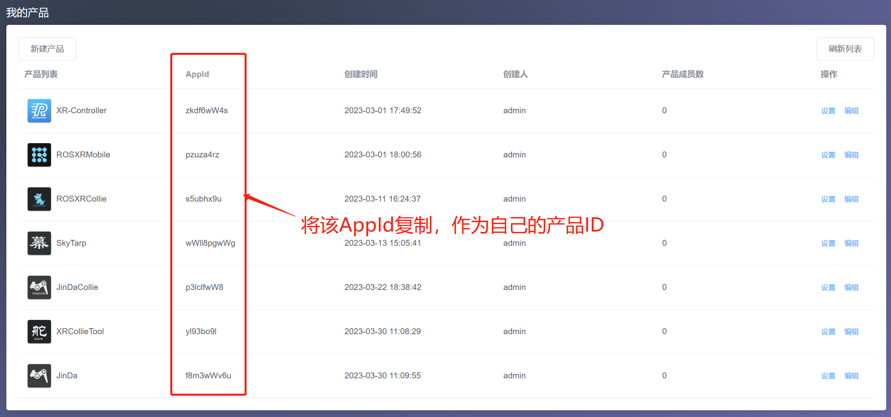

xrbugly是我模仿腾讯bugly开发的android软件升级框架，目前已经将工程开源到github上面去，工程地址：**https://github.com/ceoifung/xrbugly**

### 使用方法
根目录的build.gradle添加仓库，不同的AS版本可能添加的方式有差异，但总得是一样的，首先都是要将jitpack.io仓库添加上去
```shell
allprojects {
	repositories {
		maven { url 'https://jitpack.io' }
	}
}
```
app的build.gradle添加
```shell
implementation 'com.github.ceoifung:xrbugly:1.0.0'
```
AndroidManifest.xml中添加
```xml
<application>
    <provider
        android:name="androidx.core.content.FileProvider"
        android:authorities="${applicationId}.fileProvider"
        android:exported="false"
        android:grantUriPermissions="true">
        <meta-data
            android:name="android.support.FILE_PROVIDER_PATHS"
            android:resource="@xml/file_paths" />
    </provider>
    <activity android:name="com.xiaor.xrbugly.XRBetaActivity"
        android:configChanges="keyboardHidden|orientation|screenSize|locale"
        android:theme="@style/MyTranslucentTheme"/>
</application>
<uses-permission android:name="android.permission.INTERNET" />
<!--请求安装权限-->
<uses-permission android:name="android.permission.REQUEST_INSTALL_PACKAGES" />
<uses-permission android:name="android.permission.READ_EXTERNAL_STORAGE" />
<uses-permission android:name="android.permission.WRITE_EXTERNAL_STORAGE" />
```

android 12以上的手机，可能还要在application的标签中添加，意思是允许访问sd卡，如果没有这条声明，可能依赖库没有办法访问内存。**另外，如果软件的下载链接指向的不是https链接，需要在application中添加`android:usesCleartextTraffic="true"`，即允许明文访问网络**
```
android:requestLegacyExternalStorage="true"
```
在自己的重写的application中添加下列初始化代码
```java

public class MyApplication extends Application {

    @Override
    public void onCreate() {
        super.onCreate();
        // 申请的软件appId
        XRBugly.init(getApplicationContext(), "appid", true);
        // 检查升级的API地址，自动检查升级
        XRBugly.autoUpgrade(getApplicationContext(), "升级地址");
    }
}
```
### appid申请
使用本仓库，需要搭配小R的软件更新后台服务程序使用，申请APPID网址
http://bugly.xiao-r.com
该网站目前不开放用户注册，默认的用户名以及密码是：
- 用户名：admin
- 密码：xiaorgeek001?

目前我已建立了几个APP软件的产品，其中的产品编码就是appid，如下图所示


### 升级地址
默认情况下，检查软件升级的API接口如下
http://bugly.xiao-r.com/api/checkUpdate

## XRUpdaterServices
XRUpdaterService是配对xrbugly的软件升级前端以及后端平台，其代码托管在：https://gitee.com/ceoifung/xrupdater-service

