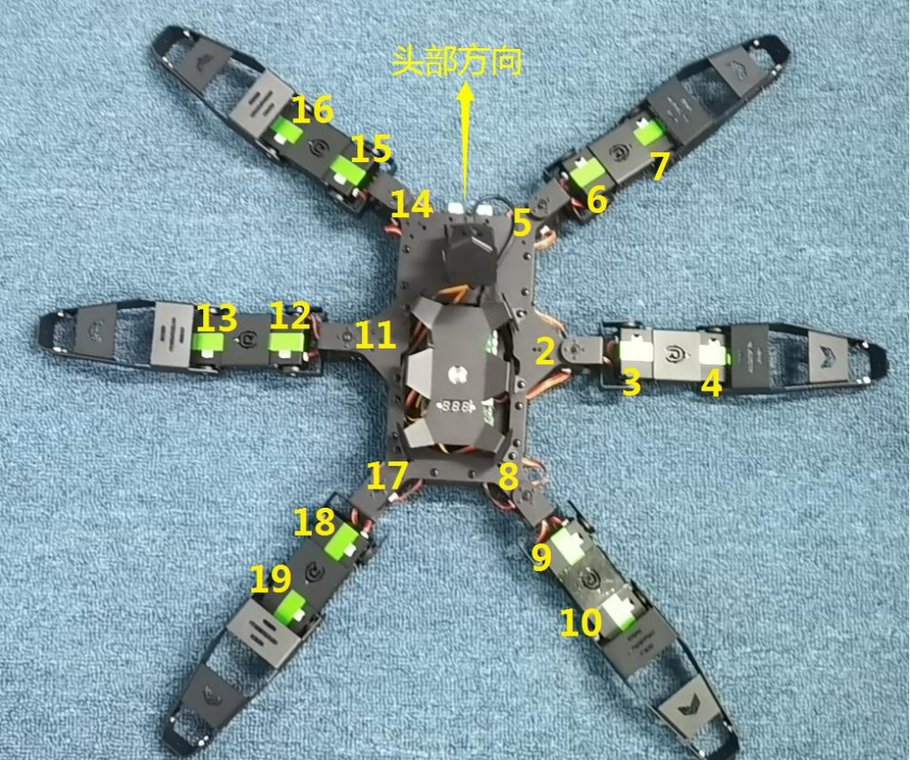

## hexapod_simple.launch
hexapod_simple.launch 是启动基本的ros服务的一个launch文件，不作任何操作，默认的文件如下
```xml
<launch>
    <arg name="config" default="phantomX"/>
    <!-- 定义自己的手柄按键映射 -->
    <arg name="joy_mapping" default="xr_joy"/>


    <rosparam command="load" file="$(find hexapod_description)/params/$(arg config).yaml" />
    <rosparam command="load" file="$(find hexapod_description)/params/dynamixel.yaml" />
    <rosparam command="load" file="$(find hexapod_description)/params/$(arg joy_mapping).yaml" />
    <param name="robot_description" command="$(find xacro)/xacro --inorder '$(find hexapod_description)/urdf/$(arg config)_model.xacro'" />
    <!--param name="robot_description" command="$(find xacro)/xacro inorder '$(find hexapod_description)/urdf' "/-->
    <!-- joy_teleop -->
    <include file="$(find hexapod_bringup)/launch/components/joy_teleop.launch" />
    <include file="$(find hexapod_bringup)/launch/components/locomotion.launch" />
    <!--include file="$(find hexapod_bringup)/launch/rviz.launch" /-->
</launch>
```

其中`<arg name="config" default="phantomX"/>`是设置hexapod参数的，`joy_mapping`是设置手柄按键映射的

## 手柄映射
默认的手柄映射文件在hexapod_description中，默认的文件如下
```yaml
# "start" button; Y
STANDUP_BUTTON: 4
# "select" button; A
SITDOWN_BUTTON: 0
# "L2" button
BODY_ROTATION_BUTTON: 8
# Left joystick up/down
FORWARD_BACKWARD_AXES: 1
# Left joystick right/left
LEFT_RIGHT_AXES: 0
# Right joystick right/left
YAW_ROTATION_AXES: 3
# Right joystick up/down
PITCH_ROTATION_AXES: 2
```

其中上面对应的数字，就是手柄按键按下产生的数组的参数，可以通过启动三个终端来查看手柄对应的键值
- 第一个终端
```shell
# 启动ros核心程序
roscore
```
- 第二个终端
```shell
# 启动手柄节点
rosrun joy joy_node
```
- 第三个终端
```shell
# 监听手柄按下的数据
rostopic echo joy
```
输出结果如下，按下按键就知道，手柄上面的键值对应的是数组里面的第几个参数，然后修改配置文件即可
```shell
header:
  seq: 39
  stamp:
    secs: 1680502498
    nsecs: 152243980
  frame_id: "/dev/input/js0"
axes: [-0.0, -0.0, 0.0, 0.0, 0.0, 0.0, -0.0, -0.0]
buttons: [0, 0, 0, 0, 0, 0, 0, 0, 0, 0, 0, 0, 0, 0, 0]
```

## xr_hexapod.yaml
这是hexapod六足的配置文件，其中主要的配置参数为SERVOS

### 舵机ID分配图



#### 初始各个关节的角度分配
| 关节名称   |      alpha      |  beta | gamma |
|----------|:-------------:|------:|------:|
| 右前腿 |  90| 90 | 90 |
| 右中腿 |  90| 90 | 90 |
| 右后腿 |  90| 90 | 90 |
| 左前腿 |  90| 90 | 90 |
| 左中腿 |  90| 90 | 90 |
| 左后腿 |  90| 90 | 90 |


### SERVOS

```yaml
SERVOS: {
    '01': {name: coxa_joint_RR, type: DS, id: 8, ticks: 2700, center: 2250, max_radians: !degrees 270, sign: 1, offset: !degrees 0},
    '02': {name: femur_joint_RR, type: DS, id: 9, ticks: 2700, center: 2250, max_radians: !degrees 270, sign: 1, offset: !degrees 14},
    '03': {name: tibia_joint_RR, type: DS, id: 10, ticks: 2700, center: 2250, max_radians: !degrees 270, sign: 1, offset: !degrees -48},
    '04': {name: coxa_joint_RM, type: DS, id: 2, ticks: 2700, center: 2250, max_radians: !degrees 270, sign: 1, offset: !degrees 0},
    '05': {name: femur_joint_RM, type: DS, id: 3, ticks: 2700, center: 2250, max_radians: !degrees 270, sign: 1, offset: !degrees 14},
    '06': {name: tibia_joint_RM, type: DS, id: 4, ticks: 2700, center: 2250, max_radians: !degrees 270, sign: 1, offset: !degrees -48},
    '07': {name: coxa_joint_RF, type: DS, id: 5, ticks: 2700, center: 2250, max_radians: !degrees 270, sign: 1, offset: !degrees 0},
    '08': {name: femur_joint_RF, type: DS, id: 6, ticks: 2700, center: 2250, max_radians: !degrees 270, sign: 1, offset: !degrees 14},
    '09': {name: tibia_joint_RF, type: DS, id: 7, ticks: 2700, center: 2250, max_radians: !degrees 270, sign: 1, offset: !degrees -48},
    '10': {name: coxa_joint_LR, type: DS, id: 17, ticks: 2700, center: 2250, max_radians: !degrees 270, sign: 1, offset: !degrees 0},
    '11': {name: femur_joint_LR, type: DS, id: 18, ticks: 2700, center: 2250, max_radians: !degrees 270, sign: 1, offset: !degrees 14},
    '12': {name: tibia_joint_LR, type: DS, id: 19, ticks: 2700, center: 2250, max_radians: !degrees 270, sign: 1, offset: !degrees -48},
    '13': {name: coxa_joint_LM, type: DS, id: 11, ticks: 2700, center: 2250, max_radians: !degrees 270, sign: 1, offset: !degrees 0},
    '14': {name: femur_joint_LM, type: DS, id: 12, ticks: 2700, center: 2250, max_radians: !degrees 270, sign: 1, offset: !degrees 14},
    '15': {name: tibia_joint_LM, type: DS, id: 13, ticks: 2700, center: 2250, max_radians: !degrees 270, sign: 1, offset: !degrees -48},
    '16': {name: coxa_joint_LF, type: DS, id: 14, ticks: 2700, center: 2250, max_radians: !degrees 270, sign: 1, offset: !degrees 0},
    '17': {name: femur_joint_LF, type: DS, id: 15, ticks: 2700, center: 2250, max_radians: !degrees 270, sign: 1, offset: !degrees 14},
    '18': {name: tibia_joint_LF, type: DS, id: 16, ticks: 2700, center: 2250, max_radians: !degrees 270, sign: 1, offset: !degrees -48},
    # '19': {name: pan_joint, type: DS, id: 19, ticks: 2700, center: 1350, max_radians: !degrees 270, sign: 1, offset: !degrees 0},
    # '20': {name: tilt_joint, type: DS, id: 20, ticks: 2700, center: 1350, max_radians: !degrees 270, sign: 1, offset: !degrees 0}
}
```
其中各个字段的代表的含义如下
- name: 关节的名字
- type: 舵机型号参数名字
- id: 对应的舵机ID号
- ticks: 舵机总的分辨率，默认的角度范围是-135~+135，刚好是270度，另外舵机的每次转动的分辨率是0.1度，所以乘以10，即是2700，0度是1350，所以90度是2250，另外舵机在物理上没有反向安装，所以sign都为1
- center: 0度位置
- max_radians: 最大的转动角度，默认为270度
- sign: 舵机是否物理上反向安装
- offset: 偏移量

### 各个关节的角度
```yaml
# Define Leg Measurements in meters
COXA_LENGTH:   0.045
FEMUR_LENGTH:  0.075
TIBIA_LENGTH:  0.140
TARSUS_LENGTH: 0.00
```


