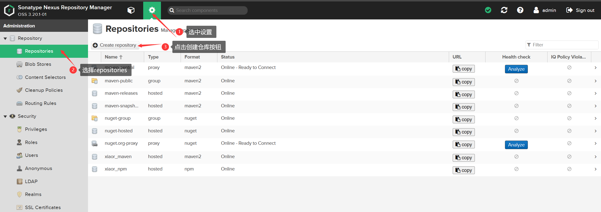
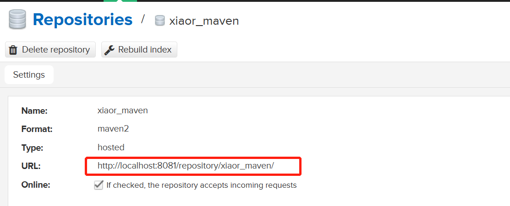

部署完nexus之后，我们可以创建一个maven仓库，用来存放我们的库代码
## 登录nexus，创建Maven仓库



执行完以上的步骤之后，仓库已经创建好了
## 查看仓库地址
回到仓库首页，可以看到创库已经创建好，点进去


可以看到仓库的地址: `http://localhost:8081/repository/xiaor_maven`



## 我们自己的maven仓库地址
```xml
http://192.168.3.109:9000/repository/xr_maven/
```
:::note
用户名：admin
密码：xiaorgeek001?
:::
支持匿名访问