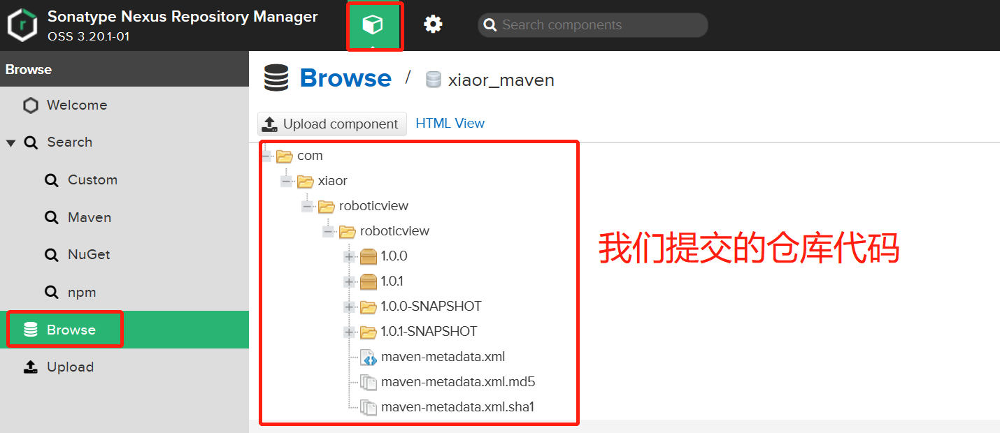

创建好maven仓库之后，我们写一个简单的Android类，然后将其发布到我们的私有maven仓库上，下面是一个简单的例程

## 环境准备
- Android Studio: 
    - 软件版本：Dolphin | 2021.3.1 Patch 1
    - gradle版本: 7 

## android工程
新建一个简单的Android工程，然后新建一个Module，如下图所示，一个完整的工程


## maven配置
在module的build.gradle中，添加类似的内容
```bash
plugins {
    id 'com.android.library'
    id 'org.jetbrains.kotlin.android'
    id 'maven-publish'
}
// 添加id 'maven-publish'
//打包main目录下代码和资源的 task
task androidSourcesJar(type: Jar) {
    classifier = 'sources'
    from android.sourceSets.main.java.srcDirs
}

afterEvaluate {
    publishing {
        publications {
            // Creates a Maven publication called "release".
            release(MavenPublication) {
                // Applies the component for the release build variant.
                from components.release

                // groupId，按需修改
                groupId = "com.xiaor.roboticview"
                artifactId = 'roboticview'
                version = '1.0.1'
            }
            // Creates a Maven publication called “debug”.
            debug(MavenPublication) {
                // Applies the component for the debug build variant.
                from components.debug

                groupId = "com.xiaor.roboticview"
                artifactId = 'roboticview'
                version = '1.0.1-SNAPSHOT'
            }
        }
        repositories {
            maven {
                // 仓库名字
                name = "xr_maven"
                allowInsecureProtocol true
                // 要推送的url
                url "http://localhost:8081/repository/xr_maven/"
                //nexus3没有开启匿名用户访问的话，添加认证信息
                credentials {
                    username = "admin"
                    password = "xiaorgeek001?"
                }
                def releasesRepoUrl = "http://localhost:8081/repository/xr_maven/"
                def snapshotsRepoUrl = "http://localhost:8081/repository/xr_maven-snapshots/"
                url = version.endsWith('SNAPSHOT') ? snapshotsRepoUrl : releasesRepoUrl

            }
        }
    }
}
```
## 仓库推送
配置好后，点击publish，如下如所示


推送成功之后，可以在nexus界面上查看仓库，如下图所示


**可以看到我们的仓库已经提交成功了，有两个版本，分别是1.0.0和1.0.1，点进去，可以看到引用地址，如下图所示**


## 其他工程引用

在工程的settings.gradle上添加
```shell
maven {
    allowInsecureProtocol true
    url 'http://localhost:9000/repository/xr_maven/'
}
```
然后再app的build.gradle上添加
```shell
 implementation("com.xiaor.roboticview:roboticview:1.0.0")
```
到这里，一整个android 库私有maven发布的教程就完成了，接下来看npm仓库怎么发布