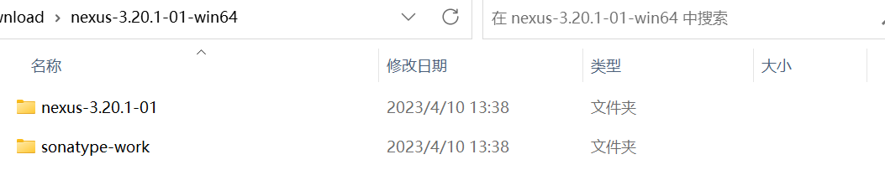

## Nexus仓库简介
Nexus 是Maven仓库管理器，如果你使用Maven，你可以从Maven中央仓库 下载所需要的构件（artifact），但这通常不是一个好的做法，你应该在本地架设一个Maven仓库服务器，在代理远程仓库的同时维护本地仓库，以节省带宽和时间，Nexus就可以满足这样的需要。此外，他还提供了强大的仓库管理功能，构件搜索功能，它基于REST，友好的UI是一个extjs的REST客户端，它占用较少的内存，基于简单文件系统而非数据库。这些优点使其日趋成为最流行的Maven仓库管理器

## Nexus下载和安装
下载地址：[Download Repository OSS](https://www.sonatype.com/products/repository-oss-download)

Nexus提供了两种安装方式，第一种是内嵌Jetty的bundle，解压到安装目录中就能直接运行；第二种方式是WAR，将其发布到web容器中即可使用。Nexus要求jdk版本为1.7(若版本不对，请调整环境变量JAVA_HOME指向jdk1.7的目录,

建议安装2.0以上版本bundle版本)。

本项目选择的是第一种安装方式，下载完nexus之后，将压缩包解压到你想要安装的目录即可。解压完成后，会得到如下两个子目录(例如Nexus版本为`3.20.1-01`)：

- nexus-3.20.1-01/：该目录包含了Nexus运行所需要的文件，如启动脚本，依赖jar包等。

- sonatype-work/：该目录包含了Nexus生成的配置文件，日志文件，仓库文件等。

用户只需调用对应操作系统的脚本就可以启动Nexus，本文主要介绍主流的Windows和Linux平台上的启动方式，详细信息如下：

Ø Windows系统：

1. 用户需要进入到nexus-3.20.1-01/bin/jsw/目录，根据操作系统类型选择文件夹，进入后双击里面的console-nexus.bat启动Nexus 。要停止服务，可以在命令行按：Ctrl+C键。例如，Win7 64位系统，选择windows-x86-64中的console-nexus.bat启动Nexus。

2. 在nexus-3.20.1-01/bin/jsw/windows-x86-64中还有其他的一些脚本：

:::tip
- install-nexus.bat：将Nexus安装成Windows服务；
- uninstall-nexus.bat：卸载Nexus Windows服务；
- start-nexus.bat：启动Nexus Windows服务；
- stop-nexus.bat：停止Nexus Windows服务；
:::

Ø Linux系统：

1. 用户需要进入到nexus-3.20.1-01/bin/jsw/目录，根据操作系统类型选择文件夹，进入后然后运行如下命令：$ ./nexus console。如果需要停止Nexus，可以使用Ctrl+C 键。例如：Ubuntu32位系统，只需进入到nexus-3.20.1-01/bin/jsw/linux-x86-32/，然后运行上面的命令即可。

2. 除console之外，Nexus的Linux脚本还提供如下的命令：

:::tip
- ./nexus start：启动后台Neuxs服务；

- ./nexus stop：停止后台Neuxs服务；

- ./nexus status：查看后台Nexus服务的状态；

- ./nexus restart：重新启动后台Nexus服务；
:::

启动完毕后，可以访问Nexus系统，访问地址：http://localhost:8081

:::tip
8081是默认的，可以在etc/nexus-default.properties中修改。
:::

:::tip
nexus3以前默认的登录用户名是`admin`，密码是`admin123`，nexus3之后，password在sonatype-work/nexus3/admin.password中。登录之后，会要求更改密码，更改完毕之后，文件将会删除
:::

